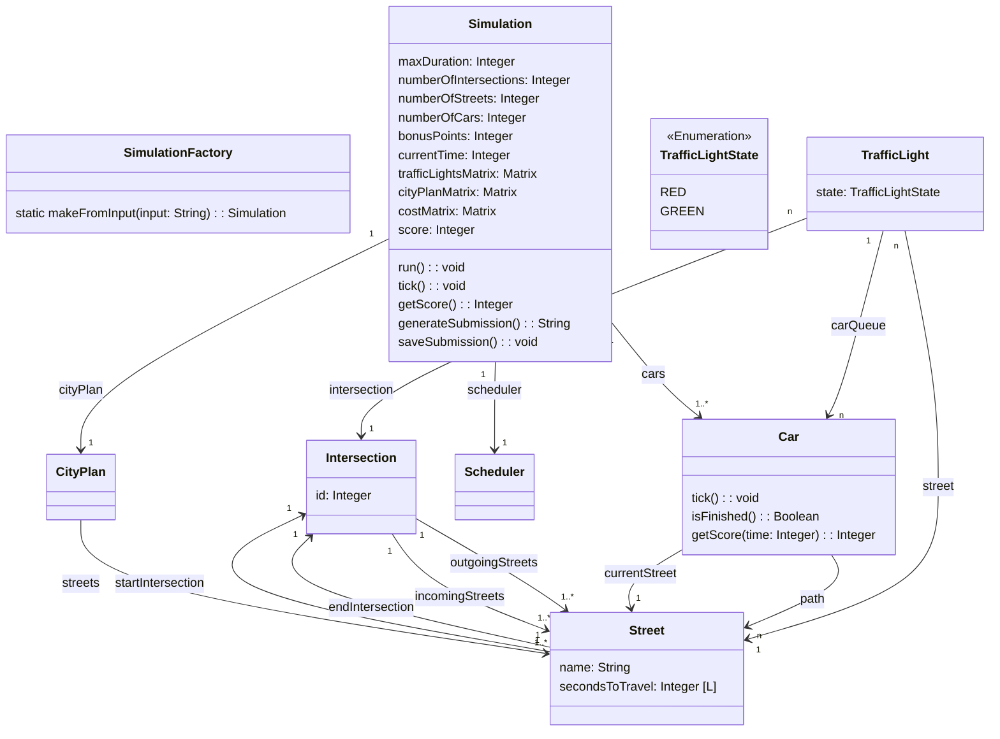
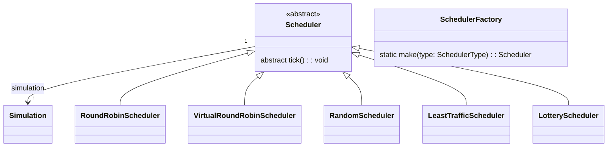

# Hash-Code-2021

This repository hosts the source code for [Hash Code 2021](https://storage.googleapis.com/coding-competitions.appspot.com/HC/2021/hashcode_2021_online_qualification_round.pdf). The project was implemented as part of the Winter Semester 2023/2024 for the `Praktische Anwendung von Algorithmen - WiSe23/24` module.

This project is developed by:

- [Manuel Kübler, B.Sc.](https://github.com/SoftwareDesign-Solution/)
- [Dominik Fladung](https://github.com/dominikfladung/)

## Getting Started

// TODO

## Project structure

// TODO

## Notes

The task is to schedule the traffic lights of a city in order to minimize the total time that cars spend travelling until they reach their destination. The city is represented as a directed graph, where intersections are nodes and streets are edges. Each street has a traffic light that signals when cars can drive along the street. Each car travels along a predefined path, which is a sequence of streets that it needs to traverse to reach its destination. The traffic lights can be scheduled to specify how long each traffic light is green.

- The cityplan is represented as a directed graph
- At most one traffic light will be green at each intersection
- When  the  light  is  green,  one  car  can  cross  the intersection every  second
- By default all lights on all intersections are red
- the scheduling of the traffic lights is optional. A traffic light can be always red
- default all traffic lights are red
- all cars start at the end of the first street in their path

### Simulation

- `costMatrix` is a matrix of integers. The value at position (i,j) is the cost of the shortest path from intersection i to intersection j.
- `cityPlanMatrix` is a matrix of integers. The value at position (i,j) is the id of the street that connects intersection i to intersection j.
- `trafficLightsMatrix` is a matrix of integers. The value at position (i,j) determines the duration of the green light of the traffic light that controls the street that connects intersection i to intersection j.



### Scheduler

Controls the traffic lights of the city. The scheduler is responsible for setting the traffic lights to green and red.

- `trafficLightsMatrix` is a matrix which contains 0 or n. If the value is 0 the traffic light is red. If the value larger 0 the traffic light is green and the value is the number of seconds the traffic light is green.



## Scores

## Round Robin

### Round Robin Quantum 1

```
Score for round_robin_a_1: 1001
Score for round_robin_e_1: 670216
Score for round_robin_f_1: 506923
Score for round_robin_c_1: 1230269
Score for round_robin_b_1: 4565601
Score for round_robin_d_1: 989401
```

### Round Robin Quantum 5

```
Score for round_robin_a_5: 0
Score for round_robin_e_5: 546686
Score for round_robin_f_5: 422413
Score for round_robin_c_5: 990001
Score for round_robin_b_5: 4546918
Score for round_robin_d_5: 0
```


### Round Robin Quantum 10

```
Score for round_robin_a_10: 0
Score for round_robin_e_10: 485384
Score for round_robin_f_10: 365874
Score for round_robin_c_10: 829997
Score for round_robin_b_10: 4524494
Score for round_robin_d_10: 0
```