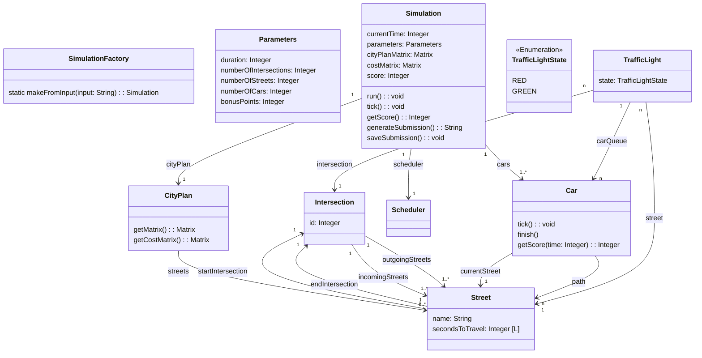
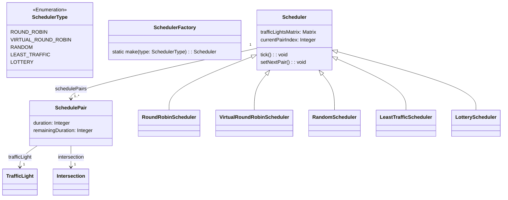

# Hash-Code-2021

This repository hosts the source code for [Hash Code 2021](https://storage.googleapis.com/coding-competitions.appspot.com/HC/2021/hashcode_2021_online_qualification_round.pdf). The project was implemented as part of the Winter Semester 2023/2024 for the `Praktische Anwendung von Algorithmen - WiSe23/24` module.

This project is developed by:

- [Manuel Kübler, B.Sc.](https://github.com/SoftwareDesign-Solution/)
- [Dominik Fladung](https://github.com/dominikfladung/)

## Getting Started

// TODO

## Notes

The task is to schedule the traffic lights of a city in order to minimize the total time that cars spend travelling until they reach their destination. The city is represented as a directed graph, where intersections are nodes and streets are edges. Each street has a traffic light that signals when cars can drive along the street. Each car travels along a predefined path, which is a sequence of streets that it needs to traverse to reach its destination. The traffic lights can be scheduled to specify how long each traffic light is green.

- The cityplan is represented as a directed graph
- At most one traffic light will be green at each intersection
- When  the  light  is  green,  one  car  can  cross  the intersection every  second
- `SchedulePair` describes the green phase
- By default all lights on all intersections are red
- the scheduling of the traffic lights is optional. A traffic light can be always red
- default all traffic lights are red
- all cars start the end of the first street in their path

### Simulation

- `costMatrix` is a matrix of integers. The value at position (i,j) is the cost of the shortest path from intersection i to intersection j.
- `cityPlanMatrix` is a matrix of integers. The value at position (i,j) is the id of the street that connects intersection i to intersection j.

### Scheduler

Controls the traffic lights of the city. The scheduler is responsible for setting the traffic lights to green and red.

- `trafficLightsMatrix` is a matrix of 1/0 values. 1 means that the traffic light is green, 0 means that the traffic light is red.

